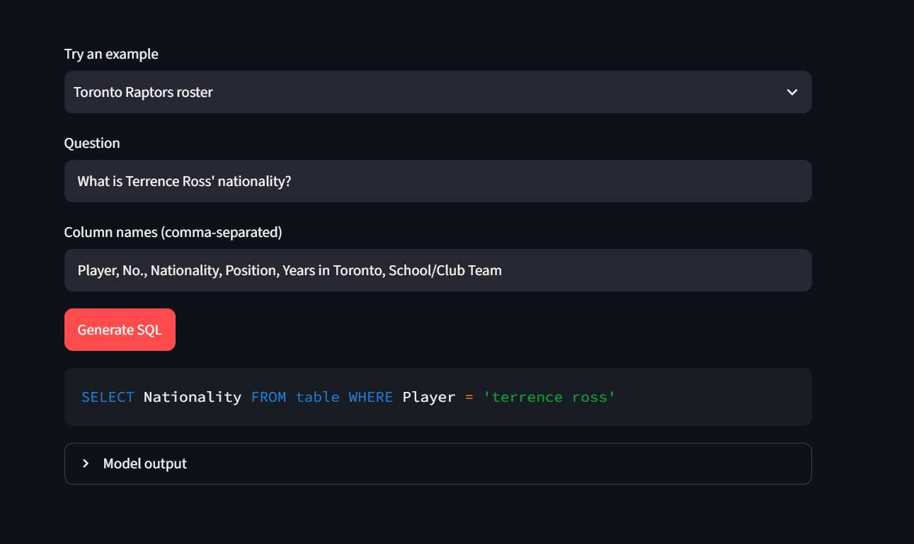

# Text-to-SQL with a from-scratch Transformer (WikiSQL)

An English question + a table's column names → a SQL query. The full encoder–decoder Transformer of
*Attention Is All You Need* is written from basic PyTorch layers (no `nn.Transformer`, no `nn.MultiheadAttention`,
no Hugging Face, no pretrained weights) and trained once from random initialisation.

Authors: Ayesha Najeeb, Nalain-e-Muhammad &nbsp;|&nbsp; Blog: [_link_](https://medium.com/@ayeshanajeeb712/teaching-a-transformer-to-write-sql-text-to-sql-on-wikisql-built-from-scratch-d2746dcc0c74) 



## Layout

| Path | What |
|---|---|
| `starter/` | data_prep, tokenizer, dataset, embeddings, check_starter (as given, unchanged) |
| `model/attention.py` | scaled dot-product + multi-head attention |
| `model/layers.py` | feed-forward, encoder layer, decoder layer, stacks |
| `model/transformer.py` | masks + full model (shared embedding / output projection) |
| `train.py` | Task 3 training loop |
| `decode.py` | greedy, beam search (4), parser, readable SQL |
| `evaluate_model.py` | prediction files, official evaluator, component accuracy, attention map, samples |
| `checks.py` | Section 3.2 correctness checks, Table 1, heat-map, LR plot, loss plot |
| `make_tables.py` | builds `results/tables.md` |
| `app/` | Streamlit front end |
| `colab_run.ipynb` | one-click Colab/Kaggle run of everything below |

## Reproduce (run everything from the repository root)

```bash
pip install -r requirements.txt
git clone https://github.com/salesforce/WikiSQL && (cd WikiSQL && tar xjf data.tar.bz2)   # creates WikiSQL/data
python starter/data_prep.py          # train/dev/test_pairs.jsonl
python starter/tokenizer.py          # shared 8k BPE -> sql_sp.model
python starter/check_starter.py      # Task 1.3 shapes
python train.py                      # 20 epochs, batch 64, warmup 4000 -> checkpoints/best.pt (needs a GPU)
python evaluate_model.py             # dev greedy + beam, official evaluator, components, attention map, samples
python evaluate_model.py --test --final beam --skip_dev   # test set, ONCE, after choosing the decoding
python checks.py                     # correctness checks + figures -> results/checks.txt
python make_tables.py                # results/tables.md
streamlit run app/app.py             # front end
```

## Configuration (exactly as specified)

d_model 256 · 4 heads (d_k = d_v = 64) · 3 encoder + 3 decoder layers · d_ff 1024 · dropout 0.1 · post-norm
`LayerNorm(x + Sublayer(x))` · encoder embedding = decoder embedding = output projection (one tensor).
Label smoothing 0.1 (ignoring `<pad>`), Adam(0.9, 0.98, 1e-9), lr = d_model^-0.5 · min(step^-0.5, step · 4000^-1.5), batch 64, 20 epochs,
checkpoint = lowest dev loss. Trainable parameters: **7,577,600**.

## Correctness checks (`python checks.py`, output of `results/checks.txt`)

```
Causal mask: max change at earlier positions after editing last token = 0.00e+00  -> PASS
Padding mask: max output change after adding 5 <pad> to the source = 3.34e-06  -> PASS
Attention rows: min/max row sum = 1.000000/1.000000; weight on <pad> keys = 0.0e+00  -> PASS
Weight sharing: output.weight is embedding.weight -> True
LR: rises for 4000 steps: True; decays after: True; lr(20000)/lr(4000)=0.4473 vs (20000/4000)^-0.5=0.4472
Gold round-trip (dev): logical form 99.49%  execution 99.49%  -> PASS
```

Sanity check not in the brief: with a constant lr of 3e-4 the model memorises 64 training examples to 64/64 exact
matches under both greedy and beam decoding, which exercises the whole model → decoder → parser path.

## Results

## Table 1 - Data

| | Train | Dev | Test |
|---|---|---|---|
| Pairs | 56,355 | 8,421 | 15,878 |
| Mean / max source length | 42.5 / 222 | 42.5 / 167 | 42.7 / 260 |
| Mean / max target length | 14.8 / 65 | 14.8 / 44 | 14.9 / 46 |
| Pairs dropped as too long | 19 | 0 | 0 |

## Table 2 - Model and training

| | |
|---|---|
| Trainable parameters | 7,577,600 |
| Epochs trained / best epoch | 20 / 19 |
| Best dev loss | 1.4541 |
| Training time and GPU | 22 min, Tesla T4 |

## Table 3 - Official metrics

| Split | Decoding | Logical form (%) | Execution (%) | Parse failures (%) |
|---|---|---|---|---|
| Dev | greedy | 64.45 | 70.73 | 0.00 |
| Dev | beam (4) | 64.94 | 71.11 | 0.00 |
| Test | beam | 64.99 | 70.97 | 0.01 |

## Table 4 - Component accuracy (dev, beam)

| sel column (%) | agg (%) | WHERE clause (%) |
|---|---|---|
| 92.72 | 89.88 | 75.23 |

## Notes

* Columns are `<cK>` tokens, so the model points at a column rather than spelling it; the front end maps them back to real names.
* Values are produced as free text copied from the question; the official engine casts them for numeric columns.
* Beam search uses the paper's length penalty (α = 0.6); decoding is batched and stops at `</s>` or 64 tokens.
* The front end supports up to 64 columns (limit of the starter vocabulary). Column names containing commas are not supported.
